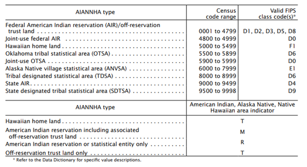
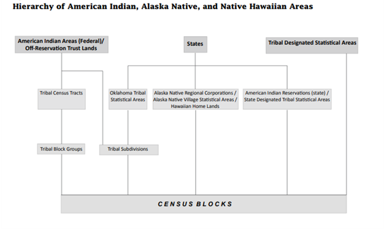

# Understanding Census data for American Indian and Alaska Native communities.

In addition to conducting the decadal U.S. Census, the Census Bureau
conducts the American Community Survey (ACS), an ongoing monthly survey
that is sent to a sample of U.S. addresses and reported annually. The
ACS collects detailed information on topics not included on the decadal
census; the Census publication *Understanding and using American
Community Survey data: What users of data for American Indians and
Alaska Natives need to know* (UAUACS:AIAN,
[acs_aian_handbook_2021.pdf](https://www.census.gov/content/dam/Census/library/publications/2021/acs/acs_aian_handbook_2021.pdf))
provides in-depth information about using ACS data to describe American
Indian and Alaska Native (AIAN) communities. Here we summarize
information from that publication and other Census documents to support
appropriate use of ACS data.

The Census Bureau reports data within spatial units or “geographies.”
(More on Census geographies here:
[acs_geography_handbook_2020.pdf](https://www.census.gov/content/dam/Census/library/publications/2020/acs/acs_geography_handbook_2020.pdf).)
Geographies may represent legal entities (e.g., states and counties) or
may be statistical entities created for Census reporting (e.g., census
blocks). Census provides 1-year estimates for geographies with
populations over 65,000, and 1-year supplemental estimates for
geographies with populations over 20,000. For smaller geographies,
Census provides only 5-year estimates. Currently, there are 38 AIAN
geographies with 1-year estimates (see Table 2.1, p. 12 in UAUACS:AIAN).

## Census geography codes by American Indian, Alaska Native, and Native Hawaiian Area type.

*What you need to know*: The Census recognizes eight types of American
Indian and Alaska Native geographies, as well as a Native Hawaiian home
land geography type (combined abbreviation AIANNH). These nine geography
types are distinguished by the value of their Census code and four
represent legal entities.

Table 1 lists the nine AIANNH geography types (AIANNHA for ‘AIANNH area’
from GTC_10.pdf, page A-9). Joint-use areas are areas claimed by more
than one tribe and are treated as separate units in Census data tables.
Note that while reservation and off-reservation trust lands are not
distinguished by Census geographic code, the Census provides data tables
for both reservation lands only and off-reservation lands only
(indicator R [reservation] and T [off-reservation trust] when reported
separately, and M when reported together, Table 1). Detailed
descriptions of these geography types can be found in GTC_10.pdf, posted
by the Census Bureau here:
<https://www2.census.gov/geo/pdfs/reference/GTC_10.pdf>.

**Table 1**: AIANNH areas and their associated census codes.

The four geography types that describe legal entities are federal
American Indian reservations (AIR) and off-reservation trust lands,
joint-use federal AIRs, Hawaiian home lands, and state AIRs. Federal
AIRs are lands designated for federally recognized tribes to which the
U.S. government holds title and over which tribes exert governmental
authority, while off-reservation trust lands are areas outside
reservations held by the Department of the Interior for tribal benefit.
State AIRs are lands designated for tribes holding state, but not
federal, recognition. Hawaiian home lands are areas held in trust for
Native Hawaiians under authority of the Hawaiian Homes Commission Act of
1920.

The remaining five geography types – OTSA, joint-use OTSA, ANVSA, TDSA,
and SDTSA – are defined by the U.S. Census Bureau for statistical
purposes with tribal input. Oklahoma tribal statistical areas (OTSA)
represent the boundaries of former reservations, while tribal designated
statistical areas (TDSA) are geographies without current federally
recognized tribal land (reservation or off-reservation trust land) that
encompass a compact and contiguous area containing a concentration of
individuals who identify with a federally recognized tribe, and in which
structured tribal activities occur.

There are **704 census codes for AIANNH areas, 588 of which are
associated with federally recognized tribes.** These 588, hereafter
FR-AIAN, represent the federal AIRs and OTSAs (including joint-use
areas), the ANVSAs, the TDSAs, two reservations still coded as state
AIRs, and one SDTSA associated with the Lumbee tribe (AIANNHCE 9815), a
newly designated federally recognized tribe. The two federally
recognized tribes with state reservations are the Pamunkey tribe of
Virginia (AIANNHCE 9260) and the Shinnecock of New York (AIANNHCE 9370).
The Census Bureau will update these codes when the reservation lands are
transferred to federal trust. The 117 non-FR-AIAN areas are the Hawaiian
home lands, state AIRs and SDTSAs.

*By the numbers*

As of the 2024 ACS, there were

-   325 federal AIR/off-reservation trust areas and 3 joint-use federal
    AIR/trust areas,

-   74 Hawaiian home lands, -

-   25 OTSA and 4 joint-use OTSA,

-   221 ANVSA,

-   7 TDSA,

-   10 state AIR, and

-   35 SDTSAs.

All AIANNHA types (codes 0001-9998) are included in Census’ *“American
Indian Area/Alaska Native Area/Hawaiian Home Land”* category.

The twelve Alaska Native Corporations represent legal entities that
follow boundaries established to divide the state of Alaska into common
heritage regions. Alaska Native Corporation codes [ANRC] are two-digit
codes between 07 and 84. ANRC data tabulations represent all residents
of the area, so that their totals correspond to those of the state.

Table 2 provides a summary of the Census tables available for the 2020
Decennial and 5-year ACS tables, including the special 2021 tables for
AIAN. Data can be accessed via data.census.gov.

**Figure 1**: Census hierarchy for AIAN geographies.

Tribal census tracts (n = 492) and block groups (n = 934) are
subdivisions of federal AIR geographies that are distinct from standard
county-based divisions; they may cross state and county boundaries.
Introduced in the 2000 Census, subdivision of an AIR into tribal census
tracts requires a population of at least 2400 and tribal block groups,
which are nested within tracts, require at least 1200. (Note: The Tribal
census tracks were modified in 2010, and do not match those used in
2000.)

In addition to the American Indian Area/Alaska Native Area/Hawaiian Home
Land (AIANNH Home Land) product, other available Census products
include:

1.  *American Indian Area* (Off-reservation trust land only)/Hawaiian
    home land, which represents (i) federal tribal areas outside
    reservations and (ii) Hawaiian home lands.

2.  *American Indian/Alaska Native Area* (Reservation or Statistical
    Entity Only), which includes (i) federal tribal reservations only
    and (ii) all statistical areas (OTSA, ANVSA, TDSA, SDTSA), i.e.,
    off-reservation trust lands and Hawaiian home lands are not included
    in this category.

3.  *Alaska Native Regional Corporation*, which summarizes data for the
    areas of Alaska covered by each corporation, n = 12.

4.  *American Indian Area Tribal Subdivision/Remainder*. This geography
    provides data summarized to the tribal subdivisions (see Figure 1).
    *Tribal subdivisions* are legal administrative subdivisions of
    federally recognized American Indian reservations and
    off-reservation trust lands or are statistical subdivisions of
    Oklahoma tribal statistical areas (OTSAs). These entities are
    internal units of self-government or administration that serve
    social, cultural, and/or economic purposes for the American Indians
    on the reservations, off-reservation trust lands, or OTSAs. The
    Census Bureau obtains the boundary and name information for tribal
    subdivisions from tribal governments, n = 484 for 2022.

Counts from products #1 and #2 sum to those presented in the *AIANNH
Home Land* tables.

The 2020 Census list of AIANNH 4-digit Census codes (AIANNHCE), 8-digit
National Standard codes (AIANNHNS), census geography area name
(AIANNHNAME) and state (ST) are included in the pipe (\|) delimitated
file national_aiannh2020.txt (file downloaded on 16-July-2025 from 2020,
link to file:
[national_aiannh2020.txt](https://www2.census.gov/geo/docs/reference/codes2020/national_aiannh2020.txt)).

The Census Bureau also provides tables that can be used to associate
county, county subdivision, and census tracts with AIANNH geographies.
These tables include (1) area of AIANNH geography, (2) area of
intersecting county, subdivision, or tract, and (3) area of overlap.
From these areas, one can calculate the proportion of the AIANNH within
intersecting counties, and the proportion of the county intersected by
an AIANNH geography. 490 of the 3234 U.S. counties (\~15%) overlap with
an AIANNH geography. Overlap proportions are sometimes used to impute
estimates for AIANNH geographies from the intersecting country,
subdivision or tract data. Links to these tables and information about
them can be found here:
[2020-aiannh-record-layout.html](https://www.census.gov/programs-surveys/geography/technical-documentation/records-layout/2020-aiannh-record-layout.html).

## Considerations for summarizing Census data to FR-AIAN geographies

The majority of the 588 FR-AIAN have populations under 20,000 (561 or
95%) and only ten have a population greater than 65,000. FR-AIAN
geographies can, and often do, include substantial numbers of non-tribal
members: for example, all but three of the ten areas over 65,000 are
OTSA geographies, where the proportion residents identifying as AIAN
alone or in combination (AIAN-AoIC) is between 11-28%. The Knik ANVSA in
Alaska, which includes suburban communities north of Anchorage, has a
total population of over 80,000, but only 13% AIAN identifying. In
contrast, the Navajo nation had a population of 165,000 during the 2020
Census, of which 97% identify as AIAN-AoIC.

The median 2020 population size of the remaining FR-AIAN is 269, and the
90th percentile is 4,242. There are 158 geographies (27%) with 2020
populations less than 100. For geographies with very small population
sizes, Census estimates will be unreliable, as a small change in the
population may have a large effect on the validity of the ACS Census
data, which represents an average for the preceding 5-year period. So,
for example, the current proportion of the population under 5 years of
age may differ substantially from the Census estimate due to the births,
aging, and family moves over the course of the 5-year interval (and
subsequently). The 5-year averages are updated each year, so they are
best used to explore trends over time versus serve as a representation
of the current population status for the geography.

Even for the ten FR-AIAN geographies with large populations, care needs
to be used to draw conclusions about AIAN populations, since all but one
of these geographies have a large proportion of non-AIAN residents.
Twenty-four percent of the FR-AIAN areas (138) have less than 50% of the
population identifying as AIAN-AoIC. In total, there are 268 FR-AIN
areas (46%) for which either (1) the area’s population is less than 100
or (2) the proportion AIAN-AoIC is less than 50%, or both.

The Census Bureau tables for AIAN geographies and for AIAN race
responses are available in regularly published tables but for limited
geographies, due to population size constraints on reporting. Every five
years, however, the Census Bureau releases a special set of 5-year
summary tables *Selected Population Tables and AIAN Data Tables* that
provide data on AIAN geographies with populations over 100. These tables
summarize the data for tribal and/or tribal grouping based on responses
to the race and ethnicity question for a large number, but not all
tribes. Although self-reported race is not equivalent to tribal
membership, these tables should be better than full population tables as
descriptors of AIAN communities.

**Table 2**: Decennial Census and American Community Survey tables with
estimates for AIAN geographies and AIAN race categories. AIAN-A = AIAN
‘alone,’ i.e., AIAN was the only race selected; AIAN-AoIC = AIAN ‘alone
or in combination,’ i.e., AIAN was selected as race, possibly with one
or more other races. Population groups are tribes or tribal groupings.
